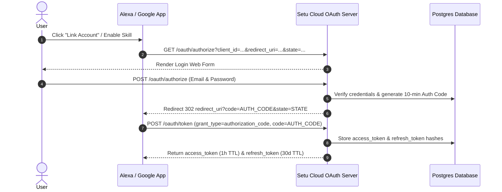
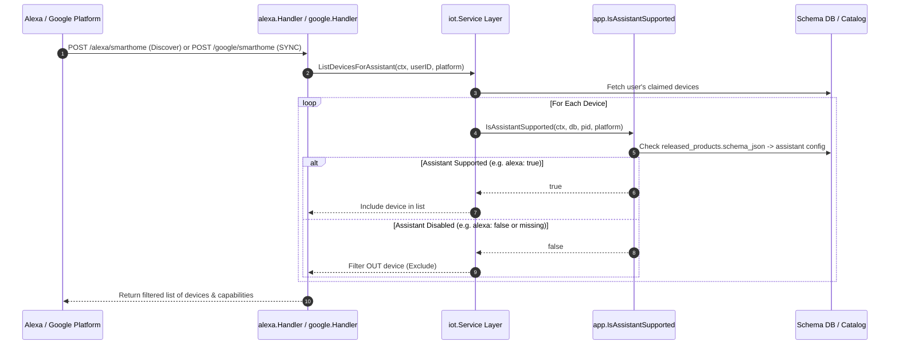
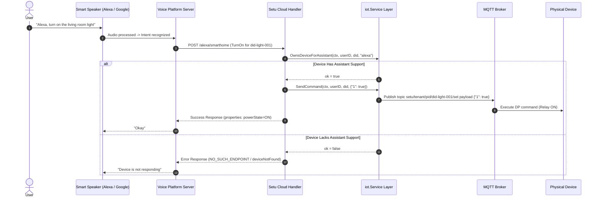
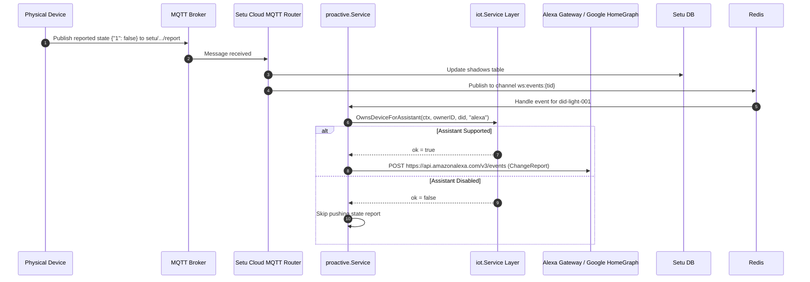

# Voice Assistant End-to-End Communication & Configuration Guide

This document details **how users request voice assistant controls**, **how Setu Cloud communicates with Voice Platforms (Alexa & Google Assistant)**, and how product-level **Assistant Configuration** filters device discovery and execution in a Tuya-like model.

---

## 1. High-Level Communication Overview

```
 [User / Voice Speaker]
         │
         │ 1. "Alexa, turn on the light" / "Hey Google, set brightness to 80%"
         ▼
 ┌──────────────────────┐        2. Directive / Intent (OAuth Bearer)
 │ Voice Assistant      │────────────────────────────────────────────────────┐
 │ Cloud (Alexa/Google) │                                                    │
 └──────────────────────┘                                                    │
         ▲                                                                   │
         │ 5. Proactive ChangeReport / ReportState                           │
         │                                                                   ▼
 ┌───────────────────────────────────────────────────────────────────────────────┐
 │ Setu Cloud Backend                                                            │
 │                                                                               │
 │  ┌──────────────────────────┐    3. OwnsDeviceForAssistant Check              │
 │  │ OAuth Authorization      │  ──────────────────────────────────────┐       │
 │  │ (Linked Accounts)        │                                        │       │
 │  └──────────────────────────┘                                        ▼       │
 │  ┌──────────────────────────┐     4. DP Translation        ┌──────────────┐   │
 │  │ alexa / google Handlers  │ ───────────────────────────> │ iot.Service  │   │
 │  └──────────────────────────┘                              └──────────────┘   │
 └────────────────────────────────────────────────────────────────────┬──────────┘
                                                                      │
                                                                      │ 5. MQTT Command
                                                                      ▼
                                                            ┌──────────────────┐
                                                            │   Smart Device   │
                                                            └──────────────────┘
```

---

## 2. Step-by-Step Communication Flows

### Flow 1: Voice Account Linking (OAuth2)

Before controlling devices, the user links their Setu Cloud account inside the Alexa or Google Home mobile app.



1. **User Request**: User opens the Alexa or Google Home app and initiates Account Linking.
2. **Setu Cloud Login**: The user authenticates with their Setu Cloud credentials at `POST /oauth/authorize`.
3. **Authorization Code**: Setu Cloud issues a single-use authorization code.
4. **Token Exchange**: The voice platform server calls `POST /oauth/token` to receive an `access_token` and `refresh_token`.

---

### Flow 2: Device Discovery & Filtering (Tuya Model)

When the user asks Alexa to discover devices or opens Google Home, the voice platform requests the list of user devices.



#### Alexa Discovery Request (`POST /alexa/smarthome`)
```json
{
  "directive": {
    "header": {
      "namespace": "Alexa.Discovery",
      "name": "Discover",
      "payloadVersion": "3",
      "messageId": "msg-123"
    },
    "payload": {
      "scope": {
        "type": "BearerToken",
        "token": "USER_ACCESS_TOKEN"
      }
    }
  }
}
```

#### Alexa Discovery Response (Filtered Devices Only)
```json
{
  "event": {
    "header": {
      "namespace": "Alexa.Discovery",
      "name": "Discover.Response",
      "payloadVersion": "3"
    },
    "payload": {
      "endpoints": [
        {
          "endpointId": "did-light-001",
          "friendlyName": "Living Room Light",
          "displayCategories": ["LIGHT"],
          "capabilities": [
            { "type": "AlexaInterface", "interface": "Alexa.PowerController", "version": "3" },
            { "type": "AlexaInterface", "interface": "Alexa.BrightnessController", "version": "3" }
          ]
        }
      ]
    }
  }
}
```

---

### Flow 3: Voice Control Execution ("Alexa, turn on the light")

When a user speaks a voice command, the voice platform sends a directive/command to Setu Cloud.



#### Google Home Execute Request (`POST /google/smarthome`)
```json
{
  "requestId": "req-999",
  "inputs": [
    {
      "intent": "action.devices.EXECUTE",
      "payload": {
        "commands": [
          {
            "devices": [{ "id": "did-light-001" }],
            "execution": [
              {
                "command": "action.devices.commands.OnOff",
                "params": { "on": true }
              }
            ]
          }
        ]
      }
    }
  ]
}
```

---

### Flow 4: Device State Query ("Alexa, is the light on?")

When a user queries device state or opens the Google Home app layout:

1. **Request**: Voice platform calls `Alexa/ReportState` or `action.devices.QUERY`.
2. **Validation**: Setu Cloud calls `OwnsDeviceForAssistant(ctx, userID, did, platform)`.
3. **Shadow Lookup**: Reads current reported DP values from the PostgreSQL `shadows` table.
4. **Response**: Transforms DP values into voice assistant properties (e.g. `powerState: "ON"`, `brightness: 80`).

---

### Flow 5: Proactive Device State Update (Physical Button / Manual Toggle)

When a physical button on a device is pressed or toggled via local app:



---

## 3. Schema Specification & Assistant Configuration

Voice assistant support is specified in product schemas in the `assistant` block.

```json
{
  "tid": "tenant-001",
  "pid": "light-rgbcw-v1",
  "version": 1,
  "assistant": {
    "enabled": true,
    "alexa": true,
    "google": true
  },
  "panel": {
    "display": {
      "icon": "lightbulb",
      "default_name": "Smart Light"
    },
    "assistant": {
      "enabled": true,
      "alexa": true,
      "google": true
    }
  }
}
```

### Configuration Rules Matrix

| `assistant.enabled` | `assistant.alexa` | `assistant.google` | Alexa Discovery | Google SYNC | Alexa/Google Control |
| :---: | :---: | :---: | :---: | :---: | :---: |
| `true` | `true` | `true` | Exposed | Exposed | Allowed |
| `true` | `true` | `false` | Exposed | Excluded | Allowed on Alexa / Rejected on Google |
| `true` | `false` | `true` | Excluded | Exposed | Rejected on Alexa / Allowed on Google |
| `false` | - | - | Excluded | Excluded | Rejected (`NO_SUCH_ENDPOINT` / `deviceNotFound`) |
| Missing | Missing | Missing | Fallback to Catalog | Fallback to Catalog | Default catalog rules (`gen1` disabled, standard PIDs enabled) |

---

## 4. Code Base Reference & Files Modified

- **[schema.go](file:///root/viral/setu-cloud/internal/schema/schema.go)**: `AssistantConfig` struct, unmarshaling, and `Normalize()`.
- **[profiles.go](file:///root/viral/setu-cloud/internal/app/profiles.go)**: `ProductProfile`, `ResolveAssistantConfig`, `IsAssistantSupported`.
- **[service.go](file:///root/viral/setu-cloud/internal/iot/service.go)**: `ListDevicesForAssistant`, `OwnsDeviceForAssistant`.
- **[alexa/handler.go](file:///root/viral/setu-cloud/internal/alexa/handler.go)**: Discovery & control filtering for Alexa.
- **[google/handler.go](file:///root/viral/setu-cloud/internal/google/handler.go)**: SYNC, QUERY, & EXECUTE filtering for Google.
- **[proactive/service.go](file:///root/viral/setu-cloud/internal/proactive/service.go)**: Proactive `ChangeReport` and `ReportState` filtering.
- **[schema_test.go](file:///root/viral/setu-cloud/internal/schema/schema_test.go)**: Unit tests for assistant schema parsing & overrides.
- **[app_test.go](file:///root/viral/setu-cloud/internal/app/app_test.go)**: Unit tests for `IsAssistantSupported` product lookup logic.
